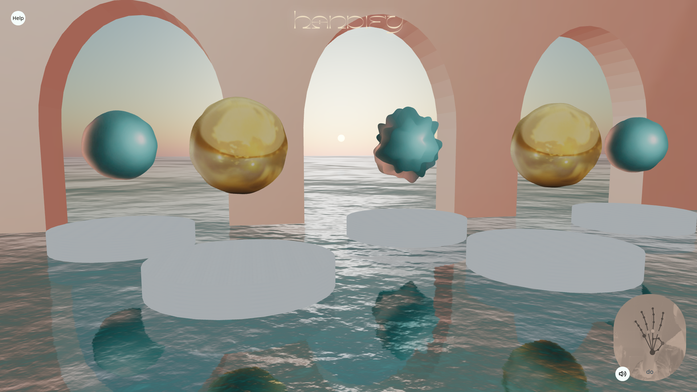

# Handify

Handify is an interface for creating sounds 🎶 based on hand gestures 👋. There is one note per finger lowered. You have to lower your fingers one after the other to create your music ✨

To begin, allow the page to access the camera and place your hand your hand in front of it. Your hand should be positioned flat and in the centre of the of the detection area.

Think to spread your fingers fingers apart to facilitate detection.

It's up to you! One finger down corresponds to one note. For the moment the site only detects one note by one note.

## More information

This project was bootstrapped with [Create React App](https://github.com/facebook/create-react-app).

In the project directory, you can run:

### `npm run start`

Runs the app in the development mode.\
Open [http://localhost:3000](http://localhost:3000) to view it in the browser.

The page will reload if you make edits.\
You will also see any lint errors in the console.

### `npm run build`

Builds the app for production to the `build` folder.\
It correctly bundles React in production mode and optimizes the build for the best performance.

The build is minified and the filenames include the hashes.\
Your app is ready to be deployed!

See the section about [deployment](https://facebook.github.io/create-react-app/docs/deployment) for more information.
